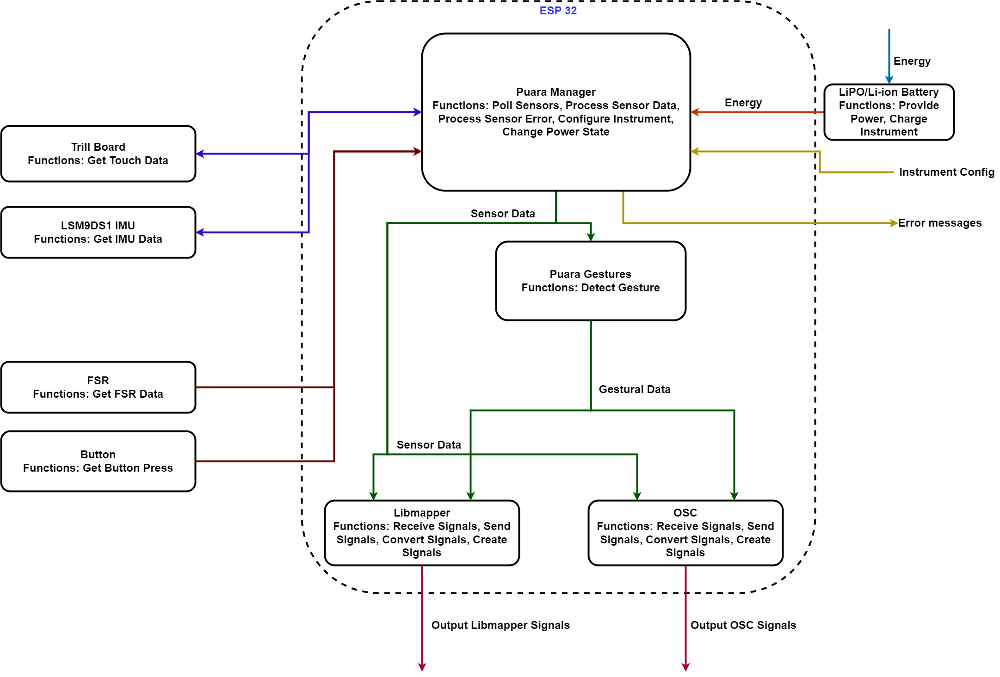

# T-Stick 4GW

# Introduction

The T-Stick 4GW was designed by Eduardo Meneses and Alex Nieva with the first revision being completed in 2018. This generation of T-Sticks is a Wi-Fi based system using Open Sound Control and later Libmapper for sending signals. It uses the ESP32 microcontroller for controlling the T-Stick. Multiple development boards such as the Lolin D32 and TinyPico have been used with this design. Although the design is modular and can in theory support T-Sticks up to the length of a Tenor T-Stick. Limitations due to how the T-Stick is constructed and firmware makes this design appropriate only for Sopranino and Soprano T-Sticks.

Note that as the TinyPico is now discontinued it can be replaced with the TinyS3, but changes to the 3D skeleton may need to be done.

# System Architecture

The T-Stick can be split into four subsystems: a control system, power system, sensor system, and mapping system. The current architecture of the T-Stick 4GW is shown below.

 

The control system interprets the outputs of the sensor system, identifies gestures, and manages the power state of the T-Stick (on/sleep/off). The power system delivers power to the rest of the subsystems as well as handling the charging and discharging of batteries. The sensor system handles the input of the user as well as basic signal processing. The raw and processed signals are sent to the control system to be interpreted. The mapping system handles the T-Stick’s connections with external devices. This is handled by either libmapper or OSC. The system handles sending and receiving signals.

## Gesture Algorithms

Note: Section is still a Work in Progress

The fourth generation T-Sticks are the first T-Sticks to include embedded gesture extraction. The table below lists all the properties that are extracted for the high level gesture.

### Table 1: High Level Gestures

| Address | Data type | Min | Max | Description |
|----|----|----|----|----|
| /instrument/touch/all | float | 0 | 1 | Amount of touch |
| /instrument/touch/top | float | 0 | 1 | Amount of touch on the top region |
| /instrument/touch/middle | float | 0 | 1 | Amount of touch for the middle part |
| /instrument/touch/bottom | float | 0 | 1 | Amount of touch for the bottom part |
| /instrument/touch/frame/position | integer | 0 | Number of touch sensors - 1 | Position of frame start from bottom |
| /instrument/touch/frame/size | integer | 0 | Number of touch sensors - 2 | Size of frame |
| /instrument/touch/frame/touch\[N\] | integer | 0 | 1 | Touch values within frame |
| /instrument/brush/up | float | 0 | 1 | Distance traveled during brush up |
| /instrument/brush/down | float | 0 | 1 | Distance traveled during brush down |
| /instrument/brush/amplitude | float | 0 | 1 | Amplitude of brush |
| /instrument/brush/energy | float | 0 | 1 | Brush energy |
| /instrument/orientation/yaw | float | -1 | 1 | Yaw |
| /instrument/orientation/pitch | float | -1 | 1 | Pitch |
| /instrument/orientation/roll | float | -1 | 1 | Roll |
| /instrument/shake | float | 0 | 1 | TBD |
| /instrument/jerk | float | 0 | 1 | TBD |
| /instrument/thrust/x | float | -1 | 1 | Thrust/jab gesture magnitude |
| /instrument/thrust/y | float | -1 | 1 | Thrust/jab gesture magnitude |
| /instrument/thrust/z | float | -1 | 1 | Thrust/jab gesture magnitude |
| /instrument/squeez | float | 0 | 1 | Same as pressure for now |
| /instrument/rest | float | 0 | 1 | High when interaction activity is low |
| /instrument/effort | float | 0 | 1 | High when interaction activity is high |

