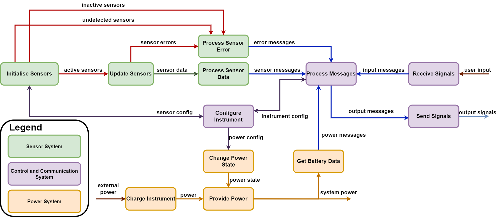

# T-Stick Functions

## Introduction

This page outlines the high level functions the T-Stick does and links previous designs of the T-Stick for inspiration of how the functions were accomplished.

## Functional Analysis

As shown in figure below the T-Stick has a relatively straight forward functional flow block diagram. 

 

The sensors must be initialised, and then regularly polled for their raw sensor data. Any sensor errors must be processed and then converted to error messages to be sent to the user. In the fourth generation of T-Sticks this function is not fully developed but still exists, as most errors are at least printed to the serial monitor. The power system of the T-Stick handles charging the instrument, providing power to all components and changing the power state between active operation and deep sleep. The control and communication system output signals and interpret any user inputs/signals such as using the serial monitor to reboot the T-Stick.

## Previous Designs

1. [T-Stick 4GW](./designs/T-Stick%204GW.md): Wi-Fi based T-Stick design, primarily for Sopranino and Soprano T-Stick with limited support for Alto and Tenor T-Stick. Uses the TinyPico ESP32 development board for control and communication along with a FSR for pressure sensing, a Trill Board for touch sensing and a LSM9DS1 for orientation and acceleration measurements.
2. [T-Stick 5GW](./designs/T-Stick%205GW.md): Wi-Fi based T-Stick design featuring a custom ESP32-S3 development board using a WROOM2 Module, alongside a ICM20948 IMU for orientation and acceleration measurements, a MAX17055 for battery management and keeping the Trill Board and FSR from the 4GW design.

