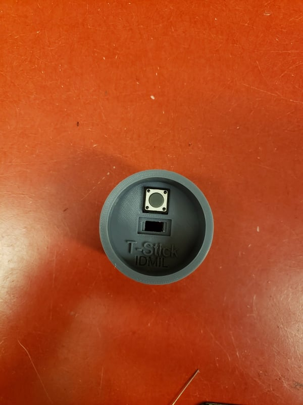
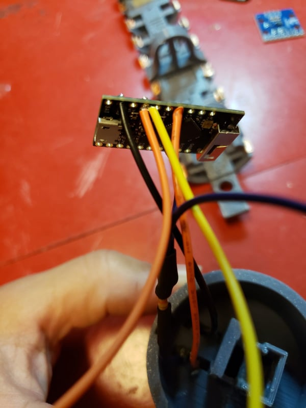
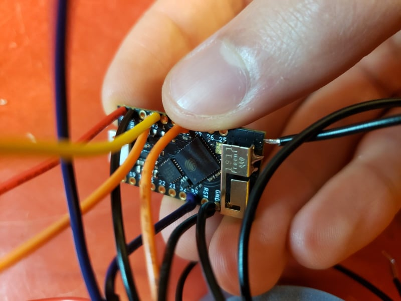
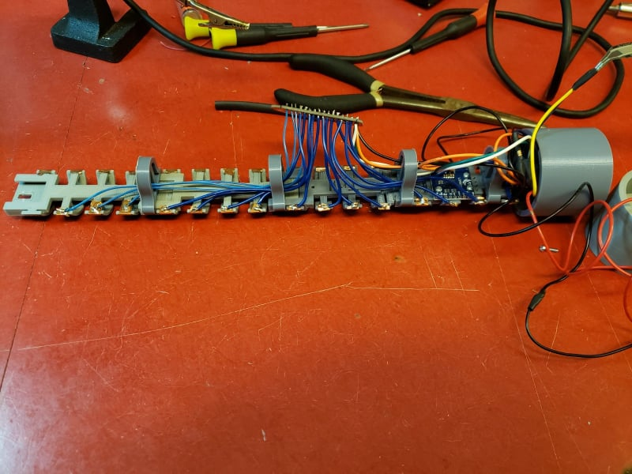
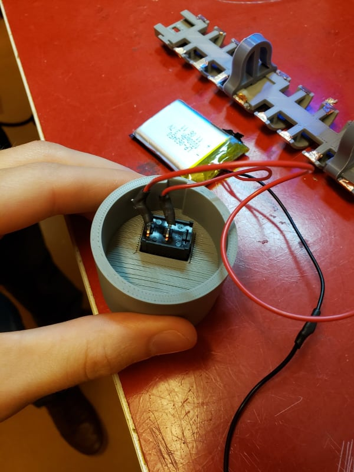
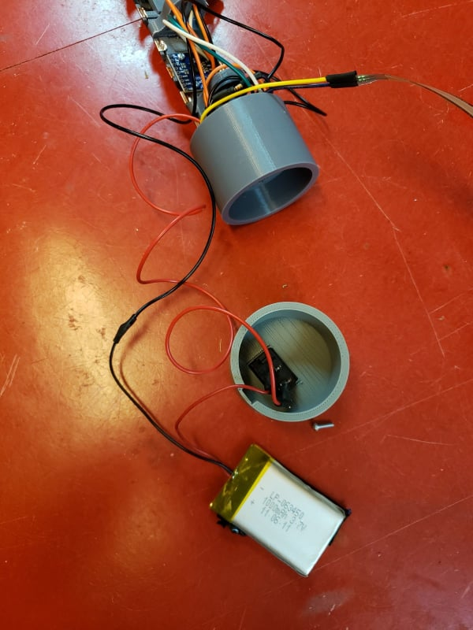

# Getting Started

# Building a Sopranino T-Stick 4GW

## Bill of Materials

| Qty | Description |
|----|----|
| 01 | [Trill](https://shop.bela.io/products/trill-craft/) |
| 01 | [TinyPICO](https://www.adafruit.com/product/4335) |
| 01 | [IMU breakout board LSM9DS](https://www.sparkfun.com/products/13284) |
| 01 | [FSR 408](https://www.robotshop.com/ca/en/interlink-24-long-fsr.html) |
| 01 | 1K resistor |
| 01 | [10K potentiometer](https://www.digikey.com/products/en?mpart=PV36W103C01B00&v=118) |
| 01 | [button](https://www.digikey.ca/product-detail/en/c-k/PTS125SM43-2-LFS/CKN9100-ND/1146743) |
| 01 | Li-Po Battery min 1000mA |
| 01 | PVC Tube (30 cm) |
| \~85cm | Copper adhesive tape |
| 01 | [ON-OFF rocker switch](https://www.digikey.ca/product-detail/en/RA1113112R/EG5619-ND/3778055/?itemSeq=307636370) |
| \~35cm | Heat shrink tube |
| 01 | end-cup with microcontroller base |
| 01 | end-cup with for the ON-OFF switch |
| 01 | [3D printed bases](https://../3D_printing/), one of each file, and 4 regular poles |
| 11 | [M2 Mounting Screws](https://www.digikey.ca/product-detail/en/MPMS+002+0008+PH/H739-ND/274950/?itemSeq=307635387) |
| 01 | [foam sheet](https://www.amazon.ca/Craft-Foam-Sheets-Assorted-Colours/dp/B005EQPRM6) |

## Instructions

### Printing the Frame

Print one of each of the [3d printing files](https://../3D_printing/), but print 4 copies of the "regular poles". The beds (pieces that snap together) will need supports on the piece that snaps.

 

 

Snap the beds together as in the image above, snapping the regular poles between beds to secure them. Place copper strips on each arc in the beds, these will be used for capacitive touch sensing.

### Soldering Components

All the building tools can be found in the Machine Shop at the McGill Music Tech Department.

 

Let's start with the end cap where the TinyPICO will be inserted. Insert the button into the slot like the pictures below.

| button top view | button bottom view | soldering |
|----|----|----|
|      |      |   |

Solder 2 wires diagonally to the button pins, connecting one to GND and one to pin 15 on the TinyPICO. For the GND connection, twist an extra wire together before soldering to the TinyPICO, which will be used for connecting the IMU later on.

| connecting to TinyPICO | completed button circuit |
|----|----|
|   |   |

To prepare the resistor for its FSR connection, solder 2 wires to one end and 1 to the other like below. Use heat shrink to wrap the connection. Solder the single end wire to a GND pin on the button. Solder one of the double end wires to pin 33 on the TinyPICO.

| soldering | heat shrinking | connecting to TinyPICO |
|----|----|----|
|    |      |      |

Prepare the FSR connections by carefully soldering 2 wires to its terminals, using the extra wire form the resistor as one of the terminals. Be cautious not to melt the plastic on the FSR if possible by soldering quickly. Heat shrink the terminals when complete.

| soldering | heat shrinking |
|----|----|
|      |      |

Solder the other FSR wire **and** another wire (which will connect to the IMU) to the 3V3 pin on the TinyPICO (yellow and orange in the picture below). Twisting the 2 wires together before inserting into the pin will make this task easier.

| twisting and soldering | view of 3V3 pin |
|----|----|
|      |      |

Solder 2 wires to each of the IMU's GND, VCC, SDA and SCL pins. One of the VCC wires and one of the GND wires should be the extra 3V3 and GND wires from the TinyPICO that you put in in the above steps. Connect one of the SDA wires to pin 21 of the TinyPICO, and one of the SCL wires to pin 22 of the TinyPICO.

| twisting and soldering | connecting to TinyPICO | imu wiring |
|----|----|----|
|      |      |      |

At this stage, the IMU should have unconnected wires (1 of each) from SDA, SCL, GND and VCC. Run the 4 unconnected wires through the pole and solder to the corresponding labeled pins on the Trill.

| trill connections | alternate view |
|----|----|
|      |      |

Now for the fun part ;). Solder wires onto each of the 15 copper strips, running them through the poles to the Trill board when necessary. When cutting wires for this part, allow enough length to get to the Trill, but not too long to clutter the internals. Solder the other ends of the wires **in order** from pico towards the end cap to pins 0-15 on the Trill board.

| copper soldering | alternate view |
|----|----|
|      |      |

Connect long wires from the 5V and GND pins of the TinyPICO (for the battery), and run them through the poles to the other end. Mount the IMU and Trill boards to their beds, and insert the TinyPICO into its slot in the end cap with the button. Slide the entire frame with the button cap into the PVC, making sure the long power wires can be accessed from the open end. Attach the FSR to the outside of the PVC, cutting the end if it's too long. Use the end cap's slot for the FSR wires to come out of the frame.

**IMU Mounting Note:** Please install the IMU so that this configuration is kept consistent will the design. 

 

  

Insert the power switch into the other end cap. Solder the power wire of the battery to the power switch as in the picture below, twisting together the long power wire from the TinyPICO sticking out the end. Solder the long GND wire to the battery's GND.

**Important Note**: 2nd picture below should have ran the wires through the poles and inserted into the frame before soldering to the TinyPICO, be sure to do this before soldering the battery to the TinyPICO.

| power soldering | power circuit view |
|----|----|
|      |      |

Hooray, you built a T-Stick!

## Document info

Version 1.2: Brady Boettcher Version 1.1: Edu Meneses - eduardo.meneses@mail.mcgill.caVersion 1.0: Alex Nieva - alex.nieva@mail.mcgill.ca

__Input Devices and Music Interaction Laboratory__ <http://www.idmil.org>Schulich School of MusicMcGill University550 Rue Sherbrooke Ouest, Suite 500Montreal, QC, H3A 1ECanada

# Flashing Firmware for T-Stick 4GW

Sopranino T-Stick 4G - LOLIN D32 PRO / TinyPico - USB - WiFi Input Devices and Music Interaction Laboratory (IDMIL)

## Option 1: using .bin files and [esptool.py](http://esptool.py)

This method is easier/faster. It uses [esptool.py](https://github.com/espressif/esptool).

### Download the [bin files](../firmware/bin)

* Download the .bin files located at the [bin folder](../firmware/bin)

### Download [esptool.py](https://github.com/espressif/esptool)

* Download the *[esptool.py](http://esptool.py)* from <https://github.com/espressif/esptool>. Use the `Download ZIP` option from Github
* Unzip the *esptool-master.zip* file

### Connect the T-Stick to the computer and check the USB port

* [Check the T-Stick (ESP32) port in your computer](https://docs.espressif.com/projects/esp-idf/en/latest/get-started/establish-serial-connection.html):
  * For MacOS/Linux:
    * install the [latest drivers from from the SiLabs website](https://www.silabs.com/developers/usb-to-uart-bridge-vcp-drivers).
    * Open a *Terminal* window
    * Execute the command `ls /dev/cu.*`. The command will return a list of ports in your computer.
    * Plug the T-Stick (USB) and run the command `ls /dev/cu.*` one more time. You can now compare the lists and anotate the T-Stick USB port. Should be something similar to `/dev/cu.wchusbserial1410`, probably with a different number
    * Linux users should also give the currently logged user read and write access the serial port over USB. Check [here](https://docs.espressif.com/projects/esp-idf/en/latest/get-started/establish-serial-connection.html) for more information
  * For Windows:
    * Check the list of identified COM ports in the [Windows Device Manager](https://support.microsoft.com/en-ca/help/4026149/windows-open-device-manager)
    * Plug the T-Stick (USB) and check the list of identified COM ports in the [Windows Device Manager](https://support.microsoft.com/en-ca/help/4026149/windows-open-device-manager) again. The T-Stick port should appear on the list. Anotate the T-Stick USB port, it should be something similar to `COM3` or `COM16`

### Flash the firmware (.bin files)

* Use *Finder*, *Terminal*, or *File Explorer* to copy the contents of the [bin](../firmware/bin/) folder (you should copy 3 .bin files) to the *esptool-master* folder
* Navigate to the *esptool-master* folder in *Terminal* or *Command Prompt*
* Run the command (__don't forget to replace the --port (/dev/cu.wchusbserial1410) option for your T-Stick port__): `esptool.py --chip esp32 --port /dev/cu.wchusbserial1410 --baud 115200 --before default_reset --after hard_reset write_flash -z --flash_mode dio --flash_freq 80m --flash_size detect 0xe000 boot_app0.bin 0x1000 bootloader_dio_80m.bin 0x10000 esp32_arduino_FW211124.bin 0x8000 esp32_arduino_FW211124.ino.partitions.bin 2686976 esp32_arduino_FW211124.spiffs.bin`. Wait for the process to be complete. Do not unplug or turn off your T-Stick during the process.

To set the T-Stick info and test if the data is being send correctly:

* Connect the T-Stick to a network (instructions [here](./T-Stick_2GW_Connecting_Guide(v1.2).md));
* Open the Pure Data (PD) or Max/MSP patch to receive T-Stick messages (they can be found [here](../Test_config/));
* Start receive OSC messages according to the chosen patch.

## Option 2: Using PlatformIO

*INSTALL ALL DEPENDENCIES AND REAL ALL OBSERVATIONS BEFORE UPLOAD !*

### Install PlatformIO

To download and install PlatformIO, follow the instructions at <https://platformio.org/platformio-ide>.

We recomment using PlatformIO under Visual Studio Code, but you can also coose another editor.

### Clone the T-Stick repository

Clone this repository using `git clone https://github.com/IDMIL/T-Stick.git`. Alternatively, you can download the repository as a zip file at <https://github.com/IDMIL/T-Stick>. Take note of the folder location.

### Open firmware project and flash it to the T-Stick

* Open the T-Stick firmware project (folder **firmware** in the T-Stick repository folder) in VSC/PlatformIO. You can get help on how to use PlatformIO at <https://docs.platformio.org/en/latest/core/quickstart.html>
* You can make any necessary changes on the firmware before flashing (e.g., changing T-Stick ID, selecting the board and capacitive board accordingly)
* If it is the first time flashing, you may see an error pointing to the ESP32 inet.h file. The file requires manual fixing. Check the issue at <https://github.com/mathiasbredholt/libmapper-arduino/issues/3>

When ready, you need to flash both the firmware and the filesystem image. Choose the proper platform accordingly (*lolin_d32_pro* or *tinypico*) and use the PlatformIO menu to flash both images to the T-Stick.

### Test T-Stick

After flashing, you can use the VSC/PlatformIO serial monitor to check if the T-Stick is booting properly. You should see T-Stick booting process.

You can also interact with the controller using the following commands:

* 's' to start setup mode
* 'r' to reboot
* 'd' to enter deep sleep

To test if the data is being send correctly:

* Connect the T-Stick to a network (instructions [here](./Docs/T-Stick_2GW_Connecting_Guide(v1.2).md))
* Open the Pure Data (PD) or Max/MSP patch to receive T-Stick messages (they can be found [here](./Configuration))
* Start receive OSC messages according to the chosen patch

# Connecting to a T-Stick 4GW

## Option 1: Wireless Connection

### Get your network details

1. Connect to the network you will be connecting the T-Stick to.
2. Note the SSID (network name) and SSID Password (network password).
3. Get your computers IP address while connected to this network. Below are linked some support articles for Windows, MacOS and Linux on how to find your computers IP address.
   * [Find your IP Address Windows](https://support.microsoft.com/en-us/windows/find-your-ip-address-in-windows-f21a9bbc-c582-55cd-35e0-73431160a1b9)
   * [Find your IP Address MacOS](https://discussions.apple.com/thread/253927735)
   * [Find your IP Address Linux](https://opensource.com/article/18/5/how-find-ip-address-linux)

### Connect to the T-Stick

 4. Power on your T-Stick and wait until the boot sequence is complete. If your T-Stick does not have a Power switch press the button once and wait for the T-Stick to turn on.
 5. Connect to the T-Stick_XXX wifi network where XXX is the ID of the T-Stick. ie: TStick_001. By default the password is mappings.
 6. Open your browser and go to <http://TStick_XXX.local/> or <http://192.168.4.1>, where XXX is the ID of the T-Stick module. 

      
 7. In the __Network__ section write the network name and password optained in Step 2 in the __SSID__ and __SSID Password__ fields.
 8. In the __OSC send settings__ put in your computer's IP address optained in Step 3 in the __Primary IP__ field.
 9. Click the green __Save__ button. You will be directed to a page saying that the information was saved successfully.
10. Click __Config__ on the top of the page to return to the orginal menu.
11. Click the green __Close and Reboot__ button at the bottom of the page.

## Option 2: Puara Serial Manager

1. Download or clone the Puara client repository at <https://github.com/Puara/puara-client>. Instructions for how to clone github repositories can be found at the link below
   * [Cloning a Git Repository](https://docs.github.com/en/repositories/creating-and-managing-repositories/cloning-a-repository).
2. Open `config_template.json`.
3. Put in the network name you want the T-Stick to connect to in the __wifiSSID__ field.
4. Put the network password in the __wifiPSK__ field.
5. Save and close `config_template.json`.
6. Run the `puara_serial_manager.py` script.
7. Connect the T-Stick to your PC using a USB cable.
8. The script should auto detect and configure the T-Stick. If the T-Stick is not being detected you may need to download the CP210x USB driver. A link can be found on [Esspressif's website](https://docs.espressif.com/projects/esp-idf/en/latest/esp32/get-started/establish-serial-connection.html).

## Guide info:

Version 1.3: (2022/11/19) Albert-Ngabo Niyonsenga - albert-ngabo.niyonsenga@mail.mcgill.caVersion 1.2: (2020/03/20) Edu Meneses - eduardo.meneses@mail.mcgill.caVersion 1.11: (2019/11/27) Edu MenesesVersion 1.1: (2019/10/27) Edu MenesesVersion 1.0: (2019/08/28) Edu Meneses

__Input Devices and Music Interaction Laboratory__<http://www.idmil.org>Schulich School of MusicMcGill University550 Rue Sherbrooke Ouest, Suite 500Montreal, QC, H3A 1ECanada