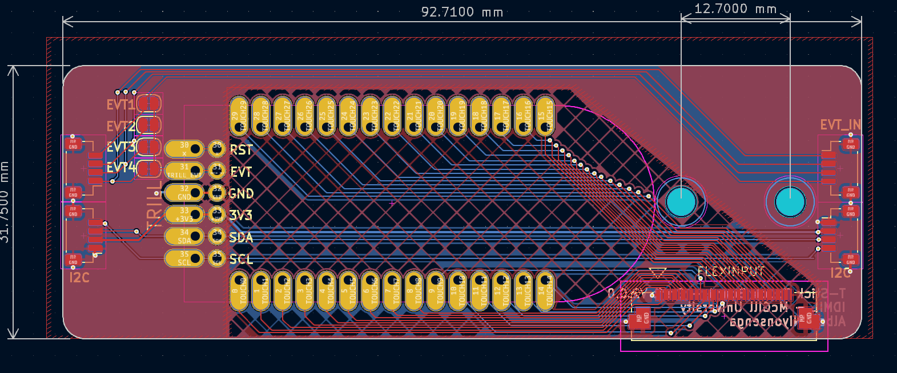
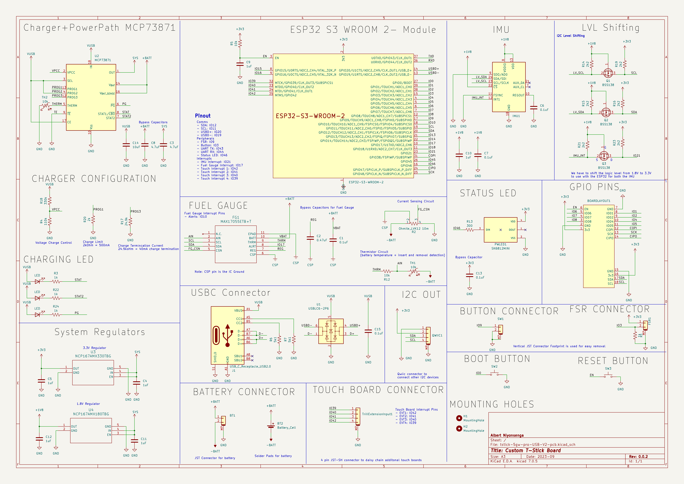
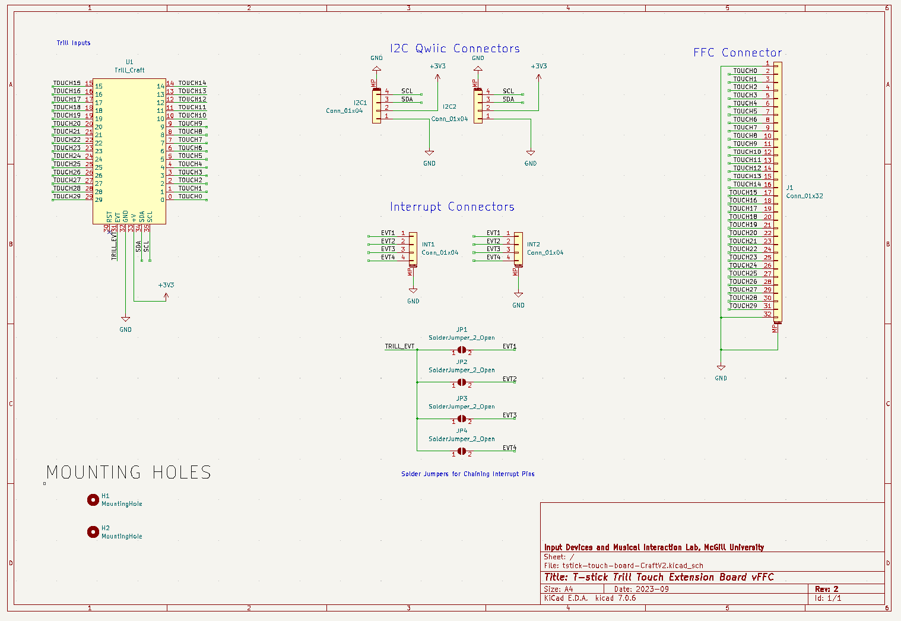

# Technical Information

## Technical Details

### Summary

| Feature | Details |
|----|----|
| Status | In Development |
| Communication Type | Wi-Fi, 802.11 b/g/n |
| Compatible protocols | Open Sound Control (OSC)/Libmapper |
| Touch Sensing Density | 1 channel per 1cm |
| Microcontroller | ESP32-S3 Series |
| Gestures Embedded? | Yes |
| Embedded Gesture Libraries | Puara Gestures |
| Sensors | ICM20948 IMU, Trill Craft Capacitive Sensing Board (30 channels), Force Sensitive Resistor 408 Series, MAX17055 Fuel Gauge |

### Detailed

| Feature | Detail |
|----|----|
| Control Loop Frequency |    |
| Wireless Latency |    |
| Battery Life |    |
| State of Charge Accuracy |    |
| Battery Voltage Accuracy |    |
| Average Sensor Latency |    |
| ICM20948 Latency |    |
| Trill Craft Latency |    |
| FSR 408 Latency |    |
| Average Sensor Accuracy |    |
| ICM20948 Accuracy |    |
| Trill Craft Accuracy |    |
| FSR 408 Accuracy |    |
| Practice Interruption Rate |    |
| Practice/Maintenance Ratio |    |

### Diagrams

 

 

### Schematic

 

 

## OSC Signal Namespace

TBD

