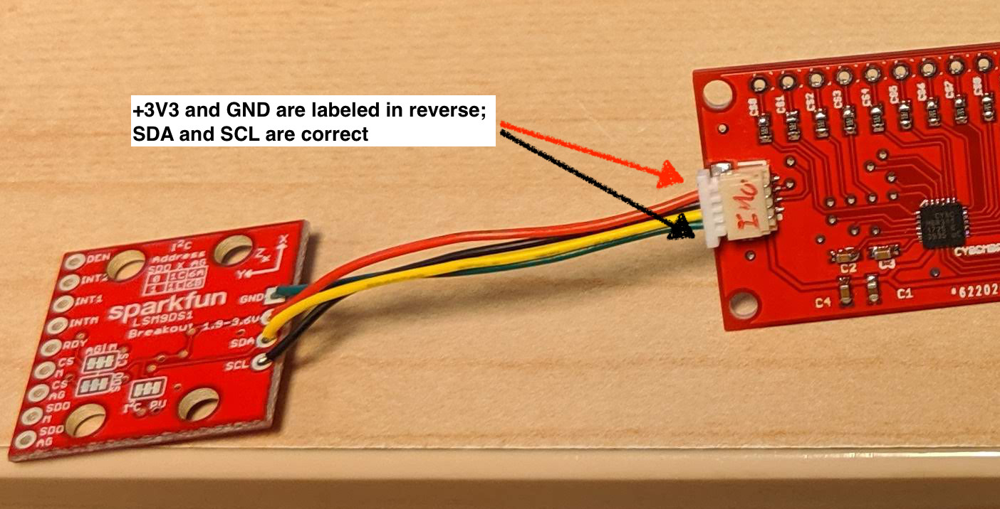
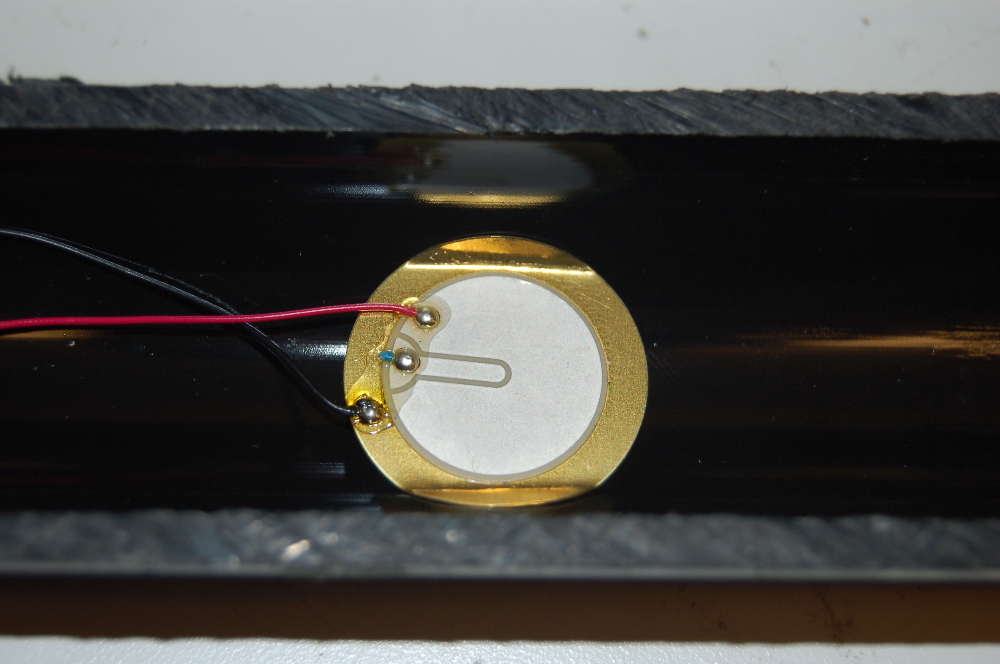
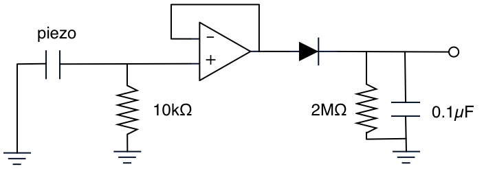
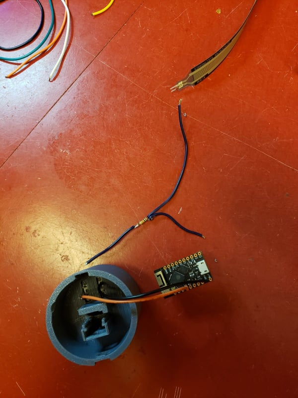
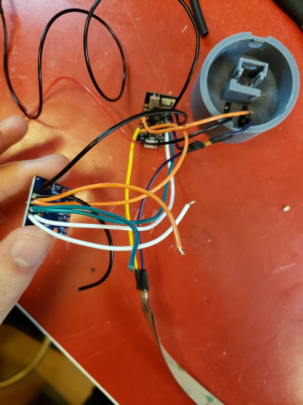
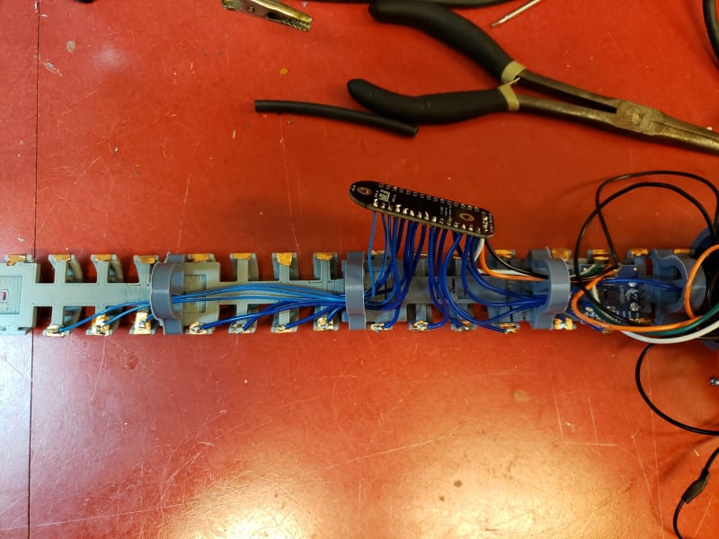

# Building a Sopranino T-Stick 4GW

=== "4GW-2018"

    ## Bill of Materials:

    Qty   | Type                | Description 
    ------|---------------------|-----------------------------------------------------------------------------------
    01    | sensor              | [Capsense](https://www.cypress.com/le/127221/download) breakout board (CY8CMBR3116)
    01    | sensor              | [IMU breakout board LSM9DS](https://www.sparkfun.com/products/13284)
    01    | sensor              | [FSR 408](https://www.robotshop.com/ca/en/interlink-24-long-fsr.html)
    01    | sensor              | [buzz elem. piezo STD](https://www.digikey.ca/product-detail/en/cui-inc/CEB-20D64/102-1126-ND/412385)
    01    | electronics         | [microcontroller Lolin D32 Pro](https://wiki.wemos.cc/products:d32:d32_pro)
    01    | electronics         | [0.1uF capacitor](https://www.digikey.ca/product-detail/en/kemet/C320C104J5R5TA7301/399-9867-1-ND/3726105)
    01    | electronics         | 1K resistor
    01    | electronics         | [10K resistor](https://www.digikey.ca/product-detail/en/CFM12JT10K0/S10KHCT-ND/2617547/?itemSeq=307630589)
    01    | electronics         | [2M resistor](https://www.digikey.ca/product-detail/en/CFM12JT2M00/S2MHCT-ND/2617413/?itemSeq=307631009)
    01    | electronics         | [Diode 1N4004](https://www.digikey.ca/product-detail/en/1N4004-TP/1N4004-TPMSCT-ND/773691/?itemSeq=307634719)
    01    | electronics         | [10K potentiometer](https://www.digikey.com/products/en?mpart=PV36W103C01B00&v=118)
    01    | electronics         | [LM358P Opamp](https://www.digikey.ca/products/en?keywords=296-1395-5-ND)
    01    | electronics         | [button](https://www.digikey.ca/product-detail/en/c-k/PTS125SM43-2-LFS/CKN9100-ND/1146743)
    02    | electronics         | [SH1.0 cables](https://www.aliexpress.com/item/32877217306.html)
    02    | electronics         | [Breadboards](https://www.digikey.ca/product-detail/en/sparkfun-electronics/PRT-08808/1568-1652-ND/7387401)
    30cm  | manufacturing parts | PVC Tube split in 2 lenghtwise
    ~85cm | manufacturing parts | Copper adhesive tape
    01    | manufacturing parts | Li-Po Battery (min 1000mA)
    01    | manufacturing parts | [ON-OFF rocker switch](https://www.digikey.ca/product-detail/en/RA1113112R/EG5619-ND/3778055/?itemSeq=307636370)
    ~35cm | manufacturing parts | Heat shrink tube
    01    | manufacturing parts | end-cup with microcontroller base
    01    | manufacturing parts | end-cup with for the ON-OFF switch and hold battery
    02    | manufacturing parts | 3D printed bases for Capsense
    02    | manufacturing parts | [3D printed bases for IMU](./Images/SopraninoIMUparts.jpg)
    11    | manufacturing parts | [M2 Mounting Screws](https://www.digikey.ca/product-detail/en/MPMS+002+0008+PH/H739-ND/274950/?itemSeq=307635387)
    11    | manufacturing parts | [M2 bolts](https://www.digikey.ca/product-detail/en/MHNZ+002+4/H761-ND/274972/?itemSeq=307635458)
    01    | manufacturing parts | [foam sheet](https://www.amazon.ca/Craft-Foam-Sheets-Assorted-Colours/dp/B005EQPRM6)


    ## Schematic:

    

    This schematic is outdated. Use for FSR and Piezo Electronics reference only.

    ## Instructions:

    #### Building the Frame:

    Cut the PVC in half as in the picture and tape the conductive tape 1.5cm apart. 
    Length of holes assembly is 1.5 * 15 for 16 strips. That is 22.5cm. You need aprox. 8 cm of copper tape per strip.

    !!! tip

        Before start assembling the T-Stick, pay attention to the position of the components. Plan yourself to place the components for them to not "overlap" each other (check image below). Also, make sure the cables are long enough to allow the tube and caps to be opened and closed properly.


    


    The Capsense (https://www.cypress.com/le/127221/download) breakout boards use 2 3D printed bases. It connects via a jumper cable with SH1.
    connectors to the D32 Pro (https://wiki.wemos.cc/products:d32:d32_pro).

    !!! warning

        THE CAPSENSE BOARD HAS THE CONNECTORS LABELED FOR THE MICROCONTROLLER (IN) AND IMU (OUT). BE CAREFUL WHEN CONNECTING THEM BECAUSE OF A LAST MINUTE CHANGE IN THE PINOUT OF THE BOARD. SEE SCHEMATIC BELOW. 

    __The Capsense label for ground and +3V3 is inverted at the end that goes to the IMU. You should connect:__

    __Capsense -> IMU__
    GND ------> +3V3
    SDA ------> SDA
    SCL ------> SCL
    +3V3------> GND

    

    Please take extra care since it is necessary to cut the cable and solder the right ends at the IMU. 

    Also, if you need to extend the length of the SH1.0 cable, __always cut the wire in half and extend using both parts according to the color__. Using two different wires can lead to mistakes since the SH1.0 cable is parallel. __Failing to follow this step can end up burning your ESP32__.

    All the building tools can be found in the Machine Shop at the McGill Music Tech Department.


    #### IMU:

    The [LSM9DS1](https://www.sparkfun.com/products/13284) IMU connects via another SH1.0 cable to the other socket on the Capsense for I2C communication. One end has the SH housing the other is open to solder onto the IMU breakout board. There are also 2 3D printed bases to attach the IMU to the frame.

    

    The T-Stick Spatial orientation is dened as follows:

    

    Please, install the IMU so that this conguration is kept consistent will the design.


    #### FSR and Piezo Electronics:

    The Force Sensitive Resistor and the Piezoelectric sensor are glued to the frame with epoxy, superglue, or hot glue. 

    

    The signal processing circuit is all analog and needs to be soldered to a perfboard. The piezoelectric circuit output is to be soldered to pin 32 of the ESP32 and the FSR circuit output to pin 33. Electronic building tools can be found in the Electronics Shop at the McGill Music Tech Department. Solder long cables to the FSR pins.

    !!! tip

        The FSR pins are very delicate. Put some heat shrink tube to reinforce the end of the fsr so it doesn’t break. If it breaks, it’s not repairable.

    Here’s the pinout for the LM358 opamp you will be using in the above circuit:

    ```
                        +--()--+
                Output A | 1   8| V+
        Inverting Input A | 2   7| Output B
    Non-Inverting Input A | 3   6| Inverting Input B
                    GND | 4   5| Non-Inverting Input B
                        +------+
    ```

    __OBS__: Don't forget to connect GND and V+.

    ##### Envelope Follower Circuit

    

    ##### Voltage Divider Circuit

    


    #### Microcontroller:

    The microcontroller to be used with the T-Stick is the Lolin D32 PRO. You can check the tech specs at https://wiki.wemos.cc/products:d32:d32_pro.

    #### Firmware:

    Instructions to upload (flash) the T-Stick firmware and configuration files can be found [here](./flashing-guide.md).

    Read and follow __ALL__ the instructions at before upload it to the board. There are some steps to prepare your machine and the ESP32 before flash it for the first time.

    It is recommended to use the board test firmwares located at https://github.com/IDMIL/TStick/tree/master/Sopranino/2GW/19X/Tests to test the capsense board and the IMU after install them.

    Nightly builds and beta firmwares can be downloaded at https://github.com/IDMIL/TStick. Before using them, contact the IDMIL's lab team.


    ## More info:

    Version 1.1: Edu Meneses - eduardo.meneses@mail.mcgill.ca\
    Version 1.0: Created by: Alex Nieva - alex.nieva@mail.mcgill.ca

=== "4GW-2021"

    ## Bill of Materials

    | Qty | Description |
    |----|----|
    | 01 | [Trill](https://shop.bela.io/products/trill-craft/) |
    | 01 | [TinyPICO](https://www.adafruit.com/product/4335) |
    | 01 | [IMU breakout board LSM9DS](https://www.sparkfun.com/products/13284) |
    | 01 | [FSR 408](https://www.robotshop.com/ca/en/interlink-24-long-fsr.html) |
    | 01 | 1K resistor |
    | 01 | [10K potentiometer](https://www.digikey.com/products/en?mpart=PV36W103C01B00&v=118) |
    | 01 | [button](https://www.digikey.ca/product-detail/en/c-k/PTS125SM43-2-LFS/CKN9100-ND/1146743) |
    | 01 | Li-Po Battery min 1000mA |
    | 01 | PVC Tube (30 cm) |
    | \~85cm | Copper adhesive tape |
    | 01 | [ON-OFF rocker switch](https://www.digikey.ca/product-detail/en/RA1113112R/EG5619-ND/3778055/?itemSeq=307636370) |
    | \~35cm | Heat shrink tube |
    | 01 | end-cup with microcontroller base |
    | 01 | end-cup with for the ON-OFF switch |
    | 01 | [3D printed bases](https://github.com/IDMIL/T-Stick/tree/main/3D_printing), one of each file, and 4 regular poles |
    | 11 | [M2 Mounting Screws](https://www.digikey.ca/product-detail/en/MPMS+002+0008+PH/H739-ND/274950/?itemSeq=307635387) |
    | 01 | [foam sheet](https://www.amazon.ca/Craft-Foam-Sheets-Assorted-Colours/dp/B005EQPRM6) |

    ## Instructions

    ### Printing the Frame

    Print one of each of the [3d printing files](https://github.com/IDMIL/T-Stick/tree/main/3D_printing), but print 4 copies of the "regular poles". The beds (pieces that snap together) will need supports on the piece that snaps.

    

    Snap the beds together as in the image above, snapping the regular poles between beds to secure them. Place copper strips on each arc in the beds, these will be used for capacitive touch sensing.

    ### Soldering Components

    All the building tools can be found in the Machine Shop at the McGill Music Tech Department.

    

    Let's start with the end cap where the TinyPICO will be inserted. Insert the button into the slot like the pictures below.

    | button top view | button bottom view | soldering |
    |----|----|----|
    |   |   |   |

    Solder 2 wires diagonally to the button pins, connecting one to GND and one to pin 15 on the TinyPICO. For the GND connection, twist an extra wire together before soldering to the TinyPICO, which will be used for connecting the IMU later on.

    | connecting to TinyPICO | completed button circuit |
    |----|----|
    |   |   |

    To prepare the resistor for its FSR connection, solder 2 wires to one end and 1 to the other like below. Use heat shrink to wrap the connection. Solder the single end wire to a GND pin on the button. Solder one of the double end wires to pin 33 on the TinyPICO.

    | soldering | heat shrinking | connecting to TinyPICO |
    |----|----|----|
    |  |   |   |

    Prepare the FSR connections by carefully soldering 2 wires to its terminals, using the extra wire form the resistor as one of the terminals. Be cautious not to melt the plastic on the FSR if possible by soldering quickly. Heat shrink the terminals when complete.

    | soldering | heat shrinking |
    |----|----|
    |     |   |

    Solder the other FSR wire **and** another wire (which will connect to the IMU) to the 3V3 pin on the TinyPICO (yellow and orange in the picture below). Twisting the 2 wires together before inserting into the pin will make this task easier.

    | twisting and soldering | view of 3V3 pin |
    |----|----|
    |   |   |

    Solder 2 wires to each of the IMU's GND, VCC, SDA and SCL pins. One of the VCC wires and one of the GND wires should be the extra 3V3 and GND wires from the TinyPICO that you put in in the above steps. Connect one of the SDA wires to pin 21 of the TinyPICO, and one of the SCL wires to pin 22 of the TinyPICO.

    | twisting and soldering | connecting to TinyPICO | imu wiring |
    |----|----|----|
    |   |    |   |

    At this stage, the IMU should have unconnected wires (1 of each) from SDA, SCL, GND and VCC. Run the 4 unconnected wires through the pole and solder to the corresponding labeled pins on the Trill.

    | trill connections | alternate view |
    |----|----|
    |    |   |

    Now for the fun part ;). Solder wires onto each of the 15 copper strips, running them through the poles to the Trill board when necessary. When cutting wires for this part, allow enough length to get to the Trill, but not too long to clutter the internals. Solder the other ends of the wires **in order** from pico towards the end cap to pins 0-15 on the Trill board.

    | copper soldering | alternate view |
    |----|----|
    |    |    |

    Connect long wires from the 5V and GND pins of the TinyPICO (for the battery), and run them through the poles to the other end. Mount the IMU and Trill boards to their beds, and insert the TinyPICO into its slot in the end cap with the button. Slide the entire frame with the button cap into the PVC, making sure the long power wires can be accessed from the open end. Attach the FSR to the outside of the PVC, cutting the end if it's too long. Use the end cap's slot for the FSR wires to come out of the frame.

    **IMU Mounting Note:** Please install the IMU so that this configuration is kept consistent will the design. 

    

     

    Insert the power switch into the other end cap. Solder the power wire of the battery to the power switch as in the picture below, twisting together the long power wire from the TinyPICO sticking out the end. Solder the long GND wire to the battery's GND.

    **Important Note**: 2nd picture below should have ran the wires through the poles and inserted into the frame before soldering to the TinyPICO, be sure to do this before soldering the battery to the TinyPICO.

    | power soldering | power circuit view |
    |----|----|
    |   |  |

    Hooray, you built a T-Stick!

    ### Document info

    - Version 1.2: Brady Boettcher
    - Version 1.1: Edu Meneses - eduardo.meneses@mail.mcgill.ca
    - Version 1.0: Alex Nieva - alex.nieva@mail.mcgill.ca