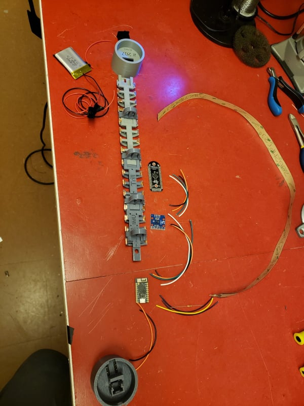
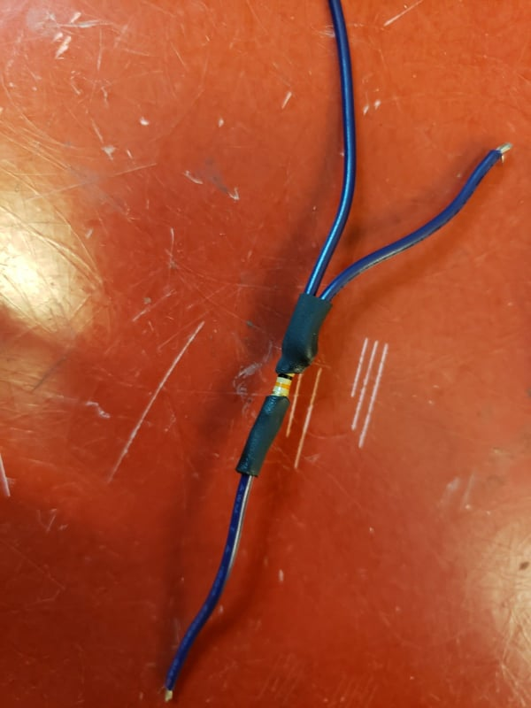
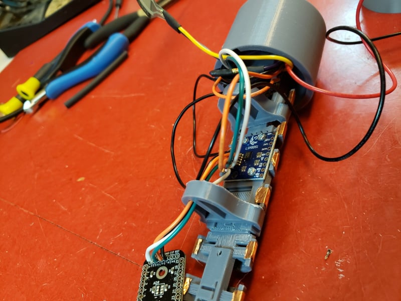

# Building a Sopranino T-Stick 4GW

## Bill of Materials

| Qty | Description |
|----|----|
| 01 | [Trill](https://shop.bela.io/products/trill-craft/) |
| 01 | [TinyPICO](https://www.adafruit.com/product/4335) |
| 01 | [IMU breakout board LSM9DS](https://www.sparkfun.com/products/13284) |
| 01 | [FSR 408](https://www.robotshop.com/ca/en/interlink-24-long-fsr.html) |
| 01 | 1K resistor |
| 01 | [10K potentiometer](https://www.digikey.com/products/en?mpart=PV36W103C01B00&v=118) |
| 01 | [button](https://www.digikey.ca/product-detail/en/c-k/PTS125SM43-2-LFS/CKN9100-ND/1146743) |
| 01 | Li-Po Battery min 1000mA |
| 01 | PVC Tube (30 cm) |
| \~85cm | Copper adhesive tape |
| 01 | [ON-OFF rocker switch](https://www.digikey.ca/product-detail/en/RA1113112R/EG5619-ND/3778055/?itemSeq=307636370) |
| \~35cm | Heat shrink tube |
| 01 | end-cup with microcontroller base |
| 01 | end-cup with for the ON-OFF switch |
| 01 | [3D printed bases](https://github.com/IDMIL/T-Stick/tree/main/3D_printing), one of each file, and 4 regular poles |
| 11 | [M2 Mounting Screws](https://www.digikey.ca/product-detail/en/MPMS+002+0008+PH/H739-ND/274950/?itemSeq=307635387) |
| 01 | [foam sheet](https://www.amazon.ca/Craft-Foam-Sheets-Assorted-Colours/dp/B005EQPRM6) |

## Instructions

### Printing the Frame

Print one of each of the [3d printing files](https://github.com/IDMIL/T-Stick/tree/main/3D_printing), but print 4 copies of the "regular poles". The beds (pieces that snap together) will need supports on the piece that snaps.

 

Snap the beds together as in the image above, snapping the regular poles between beds to secure them. Place copper strips on each arc in the beds, these will be used for capacitive touch sensing.

### Soldering Components

All the building tools can be found in the Machine Shop at the McGill Music Tech Department.

 

Let's start with the end cap where the TinyPICO will be inserted. Insert the button into the slot like the pictures below.

| button top view | button bottom view | soldering |
|----|----|----|
|   |   |   |

Solder 2 wires diagonally to the button pins, connecting one to GND and one to pin 15 on the TinyPICO. For the GND connection, twist an extra wire together before soldering to the TinyPICO, which will be used for connecting the IMU later on.

| connecting to TinyPICO | completed button circuit |
|----|----|
|   |   |

To prepare the resistor for its FSR connection, solder 2 wires to one end and 1 to the other like below. Use heat shrink to wrap the connection. Solder the single end wire to a GND pin on the button. Solder one of the double end wires to pin 33 on the TinyPICO.

| soldering | heat shrinking | connecting to TinyPICO |
|----|----|----|
|  |   |   |

Prepare the FSR connections by carefully soldering 2 wires to its terminals, using the extra wire form the resistor as one of the terminals. Be cautious not to melt the plastic on the FSR if possible by soldering quickly. Heat shrink the terminals when complete.

| soldering | heat shrinking |
|----|----|
|     |   |

Solder the other FSR wire **and** another wire (which will connect to the IMU) to the 3V3 pin on the TinyPICO (yellow and orange in the picture below). Twisting the 2 wires together before inserting into the pin will make this task easier.

| twisting and soldering | view of 3V3 pin |
|----|----|
|   |   |

Solder 2 wires to each of the IMU's GND, VCC, SDA and SCL pins. One of the VCC wires and one of the GND wires should be the extra 3V3 and GND wires from the TinyPICO that you put in in the above steps. Connect one of the SDA wires to pin 21 of the TinyPICO, and one of the SCL wires to pin 22 of the TinyPICO.

| twisting and soldering | connecting to TinyPICO | imu wiring |
|----|----|----|
|   |    |   |

At this stage, the IMU should have unconnected wires (1 of each) from SDA, SCL, GND and VCC. Run the 4 unconnected wires through the pole and solder to the corresponding labeled pins on the Trill.

| trill connections | alternate view |
|----|----|
|    |   |

Now for the fun part ;). Solder wires onto each of the 15 copper strips, running them through the poles to the Trill board when necessary. When cutting wires for this part, allow enough length to get to the Trill, but not too long to clutter the internals. Solder the other ends of the wires **in order** from pico towards the end cap to pins 0-15 on the Trill board.

| copper soldering | alternate view |
|----|----|
|    |    |

Connect long wires from the 5V and GND pins of the TinyPICO (for the battery), and run them through the poles to the other end. Mount the IMU and Trill boards to their beds, and insert the TinyPICO into its slot in the end cap with the button. Slide the entire frame with the button cap into the PVC, making sure the long power wires can be accessed from the open end. Attach the FSR to the outside of the PVC, cutting the end if it's too long. Use the end cap's slot for the FSR wires to come out of the frame.

**IMU Mounting Note:** Please install the IMU so that this configuration is kept consistent will the design. 

 

  

Insert the power switch into the other end cap. Solder the power wire of the battery to the power switch as in the picture below, twisting together the long power wire from the TinyPICO sticking out the end. Solder the long GND wire to the battery's GND.

**Important Note**: 2nd picture below should have ran the wires through the poles and inserted into the frame before soldering to the TinyPICO, be sure to do this before soldering the battery to the TinyPICO.

| power soldering | power circuit view |
|----|----|
|   |  |

Hooray, you built a T-Stick!

### Document info

- Version 1.2: Brady Boettcher
- Version 1.1: Edu Meneses - eduardo.meneses@mail.mcgill.ca
- Version 1.0: Alex Nieva - alex.nieva@mail.mcgill.ca

__Input Devices and Music Interaction Laboratory__ <http://www.idmil.org>Schulich School of MusicMcGill University550 Rue Sherbrooke Ouest, Suite 500Montreal, QC, H3A 1ECanada