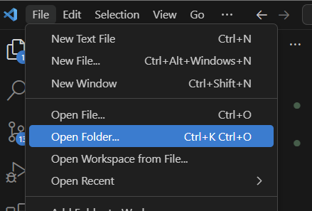
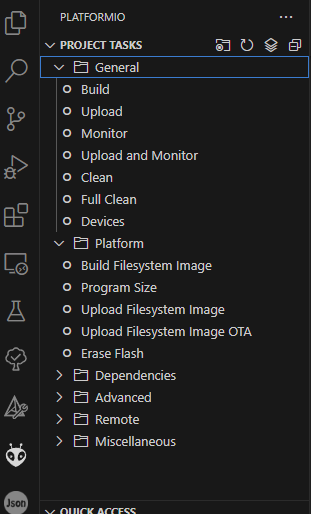

# Flashing Firmware for T-Stick 4GW

## Option 1: using .bin files and [esptool.py](http://esptool.py) [DEPRECATED]

This method is easier/faster. It uses [esptool.py](https://github.com/espressif/esptool).

### Download the [bin files](https://github.com/IDMIL/T-Stick/tree/main/firmware)

* Download the .bin files located at the [bin folder](https://github.com/IDMIL/T-Stick/tree/main/firmware)

### Download [esptool.py](https://github.com/espressif/esptool)

* Download the *[esptool.py](http://esptool.py)* from <https://github.com/espressif/esptool>. Use the `Download ZIP` option from Github
* Unzip the *esptool-master.zip* file

### Connect the T-Stick to the computer and check the USB port

* [Check the T-Stick (ESP32) port in your computer](https://docs.espressif.com/projects/esp-idf/en/latest/get-started/establish-serial-connection.html):
  * For MacOS/Linux:
    * install the [latest drivers from from the SiLabs website](https://www.silabs.com/developers/usb-to-uart-bridge-vcp-drivers).
    * Open a *Terminal* window
    * Execute the command `ls /dev/cu.*`. The command will return a list of ports in your computer.
    * Plug the T-Stick (USB) and run the command `ls /dev/cu.*` one more time. You can now compare the lists and anotate the T-Stick USB port. Should be something similar to `/dev/cu.wchusbserial1410`, probably with a different number
    * Linux users should also give the currently logged user read and write access the serial port over USB. Check [here](https://docs.espressif.com/projects/esp-idf/en/latest/get-started/establish-serial-connection.html) for more information
  * For Windows:
    * Check the list of identified COM ports in the [Windows Device Manager](https://support.microsoft.com/en-ca/help/4026149/windows-open-device-manager)
    * Plug the T-Stick (USB) and check the list of identified COM ports in the [Windows Device Manager](https://support.microsoft.com/en-ca/help/4026149/windows-open-device-manager) again. The T-Stick port should appear on the list. Anotate the T-Stick USB port, it should be something similar to `COM3` or `COM16`

### Flash the firmware (.bin files)

* Use *Finder*, *Terminal*, or *File Explorer* to copy the contents of the [bin](https://github.com/IDMIL/T-Stick/tree/main/firmware) folder (you should copy 3 .bin files) to the *esptool-master* folder
* Navigate to the *esptool-master* folder in *Terminal* or *Command Prompt*
* Run the command (__don't forget to replace the --port (/dev/cu.wchusbserial1410) option for your T-Stick port__): `esptool.py --chip esp32 --port /dev/cu.wchusbserial1410 --baud 115200 --before default_reset --after hard_reset write_flash -z --flash_mode dio --flash_freq 80m --flash_size detect 0xe000 boot_app0.bin 0x1000 bootloader_dio_80m.bin 0x10000 esp32_arduino_FW211124.bin 0x8000 esp32_arduino_FW211124.ino.partitions.bin 2686976 esp32_arduino_FW211124.spiffs.bin`. Wait for the process to be complete. Do not unplug or turn off your T-Stick during the process.

To set the T-Stick info and test if the data is being send correctly:

* Connect the T-Stick to a network (instructions [here](./connection-guide.md));
* Open the Pure Data (PD) or Max/MSP patch to receive T-Stick messages (they can be found [here](https://github.com/IDMIL/T-Stick/tree/main/Test_config));
* Start receive OSC messages according to the chosen patch.

## Option 2: Using PlatformIO [RECOMMENDED]

*INSTALL ALL DEPENDENCIES AND REAL ALL OBSERVATIONS BEFORE UPLOAD !*

You can use Visual Studio Code and the PlatformIO extension in order to flash firmware for the T-Stick-5GW.

### Setup VS Code and PlatformIO
1. Download [Visual Studio Code](https://code.visualstudio.com/download).
2. Follow the [installation guide](https://docs.platformio.org/en/latest/integration/ide/vscode.html#installation) on PlatformIO's website to setup PlatformIO extension in VS Code

!!! tip

    If you are not familiar with PlatformIO or VS Code it is recommended to read a quick start guide for both platforms before continuing this guide.

### Build the Firmware
3. Download and unzip the latest firmware from the [T-Stick reposity](https://github.com/IDMIL/T-Stick/)
4. In Visual Studio, under the File menu select open folder.
  
5. Navigate to where you downloaded the T-Stick repository and select the firmware folder.
6. On the bottom bar select the correct environment depending on your T-Stick version (ie: `tinypico` or `lolin_d32_pro`)
7. In the `main.cpp` file ensure the `TSTICK_SIZE` is the correct value for your T-Stick.
8. Navigate to the data folder and open `config.json`.
9. Update the `id` of the T-Stick to a number of your choosing.
10. Update the `author` to your name.

11. Build the firmware by clicking the checkmark on the bottom menu.

12. Click the PlatformIO Icon to show the Project Tasks.

13. Select `Build Filesystem Image`.

  

### Upload the Firmware and Filesystem Image

!!! note

    If your T-Stick was in deep sleep prior to flashing, you may have to wake up the instrument by pressing the button for it to show up on your computer.

14. Plug in your T-Stick to a USB Port on your computer.

15. In the PlatformIO Project Tasks select `Upload Filesystem Image`.

16. Once the filesystem is uploaded. Select `Upload` to flash the firmware to the board.

!!! warning

    DO NOT DISCONNECT the USB cable while the T-Stick is flashing.

After flashing, you can use the VSC/PlatformIO serial monitor to check if the T-Stick is booting properly. You should see T-Stick booting process.

You can also interact with the controller using the following commands:

- `ping` to get the T-Stick to reply pong
- `reboot` to reboot
- `sleep` to enter deep sleep

## Firmware Information

Sopranino T-Stick 4G - LOLIN D32 PRO / TinyPico - USB - WiFi Input Devices and Music Interaction Laboratory (IDMIL)