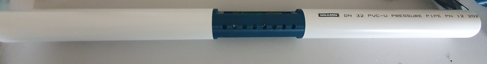

# Building a Soprano T-Stick 5GW-Enchanti

!!! warning

    This guide is still under constructions. Links to files/products may be broken. If you find a broken link please open an issue on github.

!!! note

    This guide is for building a Soprano T-Stick 5GW.

## Bill of Materials

| Qty    | Description                                                                                 |
|--------|---------------------------------------------------------------------------------------------|
| 01     | [EnchantiTouch Board](https://github.com/IDMIL/EnchantiTouch)                               |
| 01     | [EnchantiS3 Board](https://github.com/IDMIL/EnchantiS3)                                     |
| 01     | Flex PCB touch sensor                                                                       |
| 01     | 60cm FSR 408                                                                                |
| 01     | [6mm Button](https://www.adafruit.com/product/4184)                                         |
| 01     | Li-Po/Li-ion Battery min 1000mA                                                             |
| 01     | ABS/PVC Tube                                                                                |
| 02     | Sparkfun Qwiic Cable or equivalent (at least 10cm) (longer T-Sticks need additional cables) |
| 02     | JST-SH 2 pin cable                                                                          |
| \~65cm | Heat shrink tube (80mm diameter)                                                            |
| 01     | end-cup with microcontroller base                                                           |
| 01     | end-cup with for the ON-OFF switch                                                          |
| 01     | 3D printed bases, one of each file, and 4 regular poles                                     |
| 11     | M3 Mounting Screws                                                                          |
| 04     | M3 Inserts (6mm)                                                                            |
| 06     | M2 Inserts (6mm)                                                                            |
| 01     | foam sheet                                                                                  |
| 01     | Plastic glue                                                                                |
| 01     | 18650 battery holder (if using 18650 battery)                                               |
| 01     | 2 pin JST-PH cable (if using 18650 battery)                                                 |

## Instructions

### Prepare the 3D printed components

Print the following [files from the T-Stick repository](https://github.com/aburt2/T-Stick/tree/5gw-main/3D_printing/T-Stick%205GW).

- x1 esp32-bed
- x1 touch-board-bed
- x2 touch-board-door
- x1 blank-endcap
- x1 cap-closer

!!! note
    If you are using an 18650 battery you will need to print ``liion-endcap`` instead of the ``blank-endcap`` and an additional ``cap-closer``.

#### Adding inserts

Use a soldering iron or other heat source to add M2 inserts to the front of the ESP32 bed piece (x2).

Add M3 inserts to the holes inside the ESP32 bed (x2). These will be used to screw in the board to the component.

Add M2 inserts to the holes on the side of the touch board beds (x4). These will be used to screw in the touch board doors.

Add M3 inserts to the 3rd and 5th hole on the bottom of the touch board beds (x2). These will be used to secure the Enchanti touch board.

!!! tip
    Add the M3 inserts from the top (from the flat part of the piece). This will ensure that you don't get fillament in the way when attempting to screw in the boards.

### Prepare the ABS/PVC Pipe

Cut the ABS/PVC pipe into two pieces. Each with a length of about ~10inch/25cm. Use super glue or other alternative methods to glue the touch board bed to both pieces of the ABS/PVC pipe.

!!! tip
    We recommend using a drop saw/mitre saw to get a clean cut

#### Setup the touch board

Flash the Enchanti Touch board using the firmware found [here](https://github.com/IDMIL/EnchantiTouch/releases/). You can find instructions for how to flash the PSoC 4100S Max on [Infineon's website](https://www.infineon.com/dgdl/Infineon-ModusToolbox_3.2_b_VS_Code_User_Guide-UserManual-v01_00-EN.pdf?fileId=8ac78c8c8d2fe47b018e0ea954a278fb)

Use two M3 screws to screw the Enchanti Touch board to the touch board bed. Connect the touch sensor to the FFC connectors on the Enchanti Touch board. Peel the cover from the tape and tape the touch sensor against the pipe as shown below.

#### Mount the FSR

Cut the 2-pin JST cable to about 10cm as shown in the image below.

Solder the two ends of the JST cable to the two terminals of the FSR.

!!! warning
    Take care with soldering the FSR. Excessive heat will damage the FSR pins.

!!! tip
    The FSR pins are very delicate. Put some heat shrink tube to reinforce the end of the fsr so it doesn’t break. If it breaks, it’s not repairable.

!!! tip
    It is recommended to put a bit of solder on both the FSR terminals and the ends of the FSR cables. This allows you to quickly solder the FSR, without damaging the terminals due to excessive heat. Use heat shrink to prevent shorts.

Attach the FSR to the outside of the ABS/PVC pipe on the opposite end of the touch sensor, cutting the end if it's too long. Cut the foam sheets into rectangles and tape it over the FSR.

| FSR mounted, before adding foam sheet                             | FSR mounted with foam sheet                                          |
|-------------------------------------------------------------------|----------------------------------------------------------------------|
|       |        |

#### Apply Heat Shrink

Cut the Heat shrink leaving a little heat shrink at both ends of the pipe. Shrink the heat shrink over the pipe, making sure to not overtighten the heat shrink over the FSR side of the pipe. Once the heat shrink has been applied. Cut a hole in the heat shrink where the touch board is.

!!! warning
    Be careful to not cut the touch sensor

### Prepare the EnchantiS3 Board

Use two M3 screws to secure the EnchantiS3 board to the ESP32 endcap. Glue the button in the button slot on the ESP32 bed piece. Cut another 2-Pin JST cable (like the one used for the FSR). Solder the two ends of the JST cable vertically to the button pins. Connect the JST cable from the button to the BTN header on the EnchantiS3 board.

### Final Assembly

Glue both endcaps to the ends of the pipe. Connect the JST cable from the FSR to the FSR header on the EnchantiS3 board.

!!! info
    It is really important that there is a strong adhesion when gluing the components together. Use glue designed for the plastic pipe you are using.

Use M2 screws add the touch door beds to the T-Stick.

## Next Steps
Congratulations you have built a T-Stick 5GW-Enchanti! Instructions to upload (flash) the T-Stick firmware and configuration files can be found [here](./flashing-guide.md).

Read and follow __ALL__ the instructions before uploading the firmware to the board. There are some steps to prepare your machine and the ESP32 before flash it for the first time.

## More info:
Version 0.0: Created by: Albert-Ngabo Niyonsenga - aniyonsenga@gmail.com