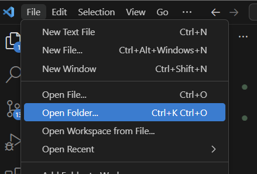

# Flashing Firmware for a T-Stick 5GW

!!! warning

    This guide is written for the preview firmware for the T-Stick 5GW located at https://github.com/aburt2/T-Stick/tree/5gw-main.

## Option 1: Using Visual Studio Code and PlatformIO

You can use Visual Studio Code and the PlatformIO extension in order to flash firmware for the T-Stick-5GW.

### Setup VS Code and PlatformIO
1. Download [Visual Studio Code](https://code.visualstudio.com/download).
2. Follow the [installation guide](https://docs.platformio.org/en/latest/integration/ide/vscode.html#installation) on PlatformIO's website to setup PlatformIO extension in VS Code

!!! tip

    If you are not familiar with PlatformIO or VS Code it is recommended to read a quick start guide for both platforms before continuing this guide.

### Build the Firmware
3. Download and unzip the latest firmware from the [T-Stick reposity](https://github.com/aburt2/T-Stick/tree/5gw-main)
4. In Visual Studio, under the File menu select open folder.
  
5. Navigate to where you downloaded the T-Stick repository and select the firmware folder.
6. On the bottom bar select the correct environment depending on your T-Stick version (ie: `tstick5gw_enchanti` or `tstick5gw_trill`)
7. In the build flags ensure the `-DTSTICK_SIZE` is the correct value for your T-Stick.
8. Navigate to the data folder and open `config.json`.
9. Update the `id` of the T-Stick to a number of your choosing.
10. Update the `author` to your name.

11. Build the firmware by clicking the checkmark on the bottom menu.

12. Click the PlatformIO Icon to show the Project Tasks.
  
13. Select `Build Filesystem Image`.

### Upload the Firmware and Filesystem Image

!!! note

    If your T-Stick was in deep sleep prior to flashing, you may have to wake up the instrument by pressing the button for it to show up on your computer.

14. Plug in your T-Stick to a USB Port on your computer.

15. In the PlatformIO Project Tasks select `Upload Filesystem Image`.

16. Once the filesystem is uploaded. Select `Upload` to flash the firmware to the board.

!!! warning

    DO NOT DISCONNECT the USB cable while the T-Stick is flashing.

!!! tip

    If the T-Stick is not responding or there are issues with flashing try unscrew the cap closer for the ESP32-S3 endcap and hold the boot button while pressing the reset button to force the board into flash mode. If you do this you may need to press the reset button after flashing to force the T-Stick to flash again.

Once the firmware is flashed you should see an orange light from the inside of the T-Stick. When the T-Stick successfully connects to a network you will see a flashing blue light.