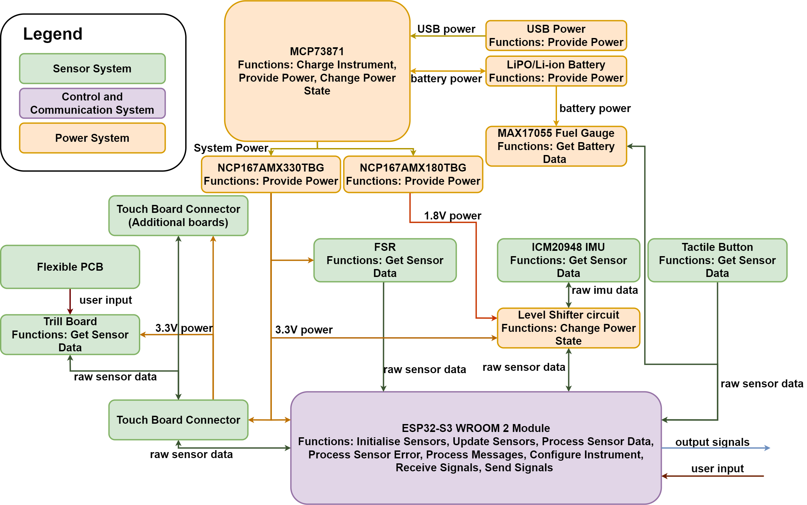

# T-Stick 5GW

## Introduction

The T-Stick 5GW consists of a custom ESP32 board which integrates a ESP32-S3 WROOM 2 Module with a ICM20948 IMU and MAX17055 on a single board, and a touch board that has a pinout for the Trill Craft board as well as, two JST-SH 4 pin connectors to daisy chain multiple touch boards together. The T-Stick switches from the Puara framework that the [4GW](../tstick-4gw/index.md) design uses in favor of Sygaldry. Sygaldry is a conceptual frame for developing digital musical instruments that are replicable, readable and reliable. Information about Sygaldry and the implementation of T-Stick Components can be found on their [website](https://enchantedinstruments.com/).

### Read more about Sygaldry

* [Design Concepts](https://enchantedinstruments.com/page-docs-design_concepts.html)
* Implementation Specific Documentation
  * [T-Stick Implementation](https://enchantedinstruments.com/page-sygin-t_stick)
  * [ESP32 Button](https://enchantedinstruments.com/page-sygse-button.html)
  * [Trill Craft Implementation](https://enchantedinstruments.com/page-sygsa-trill_craft)
  * [ICM20948 Implementation](https://enchantedinstruments.com/page-sygsp-icm20948.html)

## System Architecture

The image below shows the hardware architecture for the new T-Stick design. Most of the power sytem functions such as providing power, charging the instrument and changing the power state is handled by the MCP73871. This IC handles charging the LiPO/Li-ion battery and changing between the USB power and battery power depending on voltage. In addition, two regulators, the NCP167AMX330TBG/NCP167AMX1800TBG series are used to step down the system power to 3.3V and 1.8V respectively. The MAX17055 is used as a fuel gauge. This fuel gauge is used over its non-current sensing counter parts such as the MAX17048 due to better accuracy.

 

The Trill Craft board is kept as the capacitive sensor solution of choice. A more integrated solution using just the MCU on the Trill Craft board was considered but figuring out how to flash the MCU in a systematic way, would have been more of a hassle than it is worth. The touch board uses a 32 pin FFC connector to connect to a flexible PCB with 30 touch points and two ground points. The IMU is changed to an ICM20948 9-DOF IMU. as mentioned previously this is due to the fact that the LSM9DS1 is no longer actively supported by the company that produces it. It receives the 1.8V power from one of the regulators. Three mosfets are used to convert the 1.8V logic from the ICM20948 to 3.3V to communicate with the ESP32. 

## Technical Details

### Summary

| Feature | Details |
|----|----|
| Status | In Development |
| Communication Type | Wi-Fi, 802.11 b/g/n |
| Compatible protocols | Open Sound Control (OSC)/Libmapper |
| Touch Sensing Density | 1 channel per 1cm |
| Microcontroller | ESP32-S3 Series |
| Gestures Embedded? | Yes |
| Embedded Gesture Libraries | [Puara Gestures](../../engineering/gestures.md) |
| Sensors | ICM20948 IMU, Trill Craft Capacitive Sensing Board (30 channels), Force Sensitive Resistor 408 Series, MAX17055 Fuel Gauge |

### Detailed

| Feature | Detail |
|----|----|
| Control Loop Frequency |    |
| Wireless Latency |    |
| Battery Life |    |
| State of Charge Accuracy |    |
| Battery Voltage Accuracy |    |
| Average Sensor Latency |    |
| ICM20948 Latency |    |
| Trill Craft Latency |    |
| FSR 408 Latency |    |
| Average Sensor Accuracy |    |
| ICM20948 Accuracy |    |
| Trill Craft Accuracy |    |
| FSR 408 Accuracy |    |
| Practice Interruption Rate |    |
| Practice/Maintenance Ratio |    |

### Diagrams

 

 

### Schematic

 

 

## Signal Namespace

### firmware 240501

**Replace XXX for the T-Stick ID number**

#### Raw data

/TStick_XXX/raw/capsense, i..., 0--4095,

/TStick_XXX/raw/fsr, i, 0--4095

/TStick_XXX/raw/accl, fff, +/-24 (floats)

/TStick_XXX/raw/gyro, fff, +/-42 (floats)

/TStick_XXX/raw/magn, iii, +/-0.001 (floats)

#### Instrument data

/TStick_XXX/instrument/button/count, i, 0--i

/TStick_XXX/instrument/button/tap, i, 0 or 1

/TStick_XXX/instrument/button/dtap, i, 0 or 1

/TStick_XXX/instrument/button/ttap, i, 0 or 1

/TStick_XXX/instrument/squeeze, f, 0--1

/TStick_XXX/orientation, ffff, ?, ? ,? ,?

/TStick_XXX/instrument/ypr, fff, +/-180, +/-90 ,+/-180 (degrees)

/TStick_XXX/instrument/touch/discrete, i, i..., 0 or 1

/TStick_XXX/instrument/touch/normalised, i, i..., 0--100

/TStick_XXX/instrument/touch/all, f, 0--1

/TStick_XXX/instrument/touch/all, f, 0--1

/TStick_XXX/instrument/touch/top, f, 0--1

/TStick_XXX/instrument/touch/middle, f, 0--1

/TStick_XXX/instrument/touch/bottom, f, 0--1

/TStick_XXX/instrument/brush, f, 0--? (\~cm/s)

/TStick_XXX/instrument/multibrush, ffff, 0--? (\~cm/s)

/TStick_XXX/instrument/rub, f, 0--? (\~cm/s)

/TStick_XXX/instrument/multirub, ffff, 0--? (\~cm/s)

/TStick_XXX/instrument/shakexyz, fff, 0--?

/TStick_XXX/instrument/jabxyz, fff, 0--?

/TStick_XXX/battery/percentage, f, 0--100

/TStick_XXX/battery/voltage, f, 0--?

