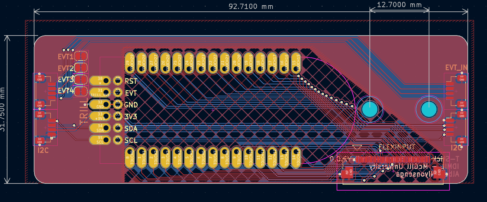
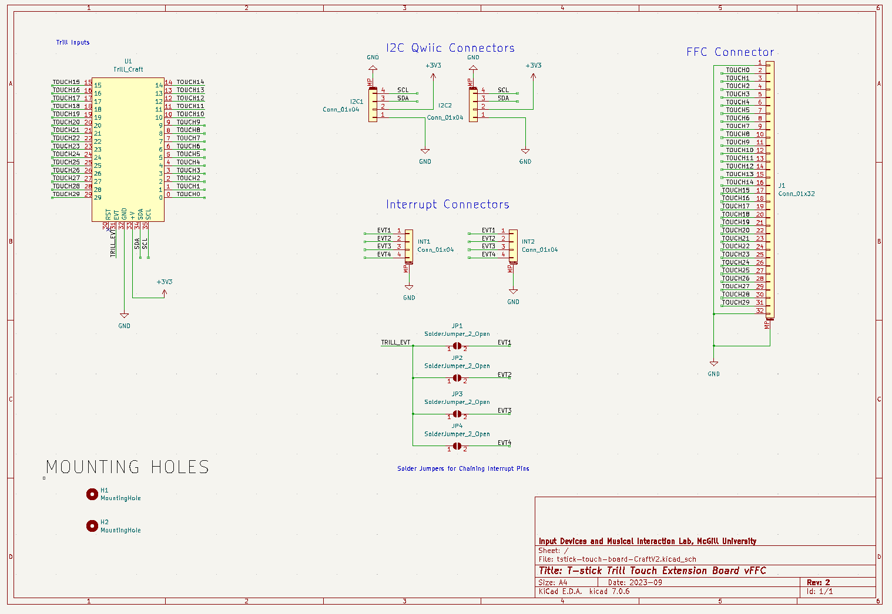

# General Information

The T-Stick 5GW consists of a custom ESP32 board which integrates a ESP32-S3 WROOM 2 Module with a ICM20948 IMU and MAX17055 on a single board, and a touch board that has a pinout for the Trill Craft board as well as, two JST-SH 4 pin connectors to daisy chain multiple touch boards together.

### Guides
For information on how to use the T-Stick 5GW check out the guides below:

- [:material-wrench: __Build Guide__](./build-guide.md)
- [:material-upload: __Flashing Guide__](./flashing-guide.md)
- [:material-wifi: __Connection Guide__](./connection-guide.md)

### 5th Generation T-Sticks
Click each box to get more information on each variant of the T-Stick 5GW

- __T-Stick 5GW-Trill__ 

    ---

    An ESP32-S3 based T-Stick using the Bela Trill Touch Board.

    [:octicons-arrow-right-24: More Details](./specs_5gw_trill.md)

- __T-Stick 5GW-Enchanti__ 

    ---

    An ESP32-S3 based T-Stick using a custom touch board.

    [:octicons-arrow-right-24: More Details](./specs_5gw_enchanti.md)

### Diagrams

 

 

### Schematic

 

 
