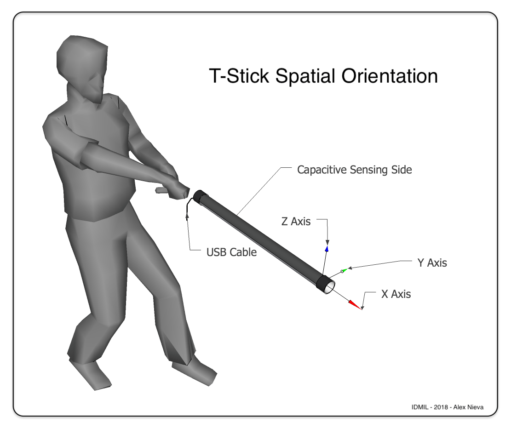

# T-Stick Design Guidelines

## Purpose

To improve interoperability between present and future T-Stick implementations.

## 1. Identity Characteristics

These features might be part of what makes an object identifiable as a T-Stick, and not some other instrument or object. These features are not normative, and serve more to introduce vocabulary that can be used in subsequent remarks.

1. T-Stick is cylindrical.
2. T-Stick usually has a diameter such that it can be held in one hand.
3. T-Stick’s outer cylindrical face has two sides; one side (termed “the top side”) has a pressure sensor, and it is usually slightly squishy e.g. due to a layer of closed cell foam adhered on that side of the instrument. The other side (termed “the bottom side”) has a (usually capacitive) fully multitouch touch sensor, and it is usually not squishy.
4. T-Stick also senses information about the orientation and motion of the instrument in space, such as the direction in the global frame of reference it is pointing (i.e. “pitch and yaw”, aka “altitude and azimuth”, aka “heading and inclination” aka etc), usually using an inertial measurement unit (IMU), or magnetic-inertial measurement unit (MIMU).
5. T-Stick usually has a recipient port for a serial communications bus connection at one end of the pipe, usually USB. This end is termed “the proximal end” of the pipe, because it is often held closer to the heart of the T-Stick player. The other end of the pipe is termed “the distal end” of the pipe.
6. The ends of the pipe are usually closed off with end caps which sometimes have buttons, lights, and/or switches embedded in them, as well as the serial bus connector on the proximal end.
7. In addition to the pipe that makes up the main body of the instrument, a T-Stick often has an internal structure. Sensors may be attached to the pipe, the internal structure, the endcaps, or a combination of these parts.

## 2. Hardware Standards

These remarks are meant to be normative. Adherence to these remarks is meant to improve interoperability between present and future T-Stick implementations.

Many of the following standards are based on the dimensions of materials readily available in Canada where most T-Sticks are currently made. T-Stick builders in regions where available materials are sold with different base dimensions may wish to define local standards.

### 2.1. Coordinate Systems

The global coordinate system used in T-Stick implementations is a right-handed East-North-Up 3-dimensional orthogonal Cartesian coordinate system. The positive X axis points to the East. The positive Y axis points North. The positive Z axis points up.

The performance-local coordinate system used in T-Stick implementations is derived by a rotation of the global coordinate system about the Z axis, such that the performance-local X axis points from center stage to stage right (i.e. from left to right when standing on stage facing the audience), and the performance-local Y axis points from center stage to downstage (i.e. towards the audience).

The T-Stick-local coordinate system is used to give directions relative to the body of the T-Stick. The X axis points from the proximal end of the pipe to the distal end of the pipe. The Y axis is determined from a 90 degree counterclockwise rotation of the X axis about the Z axis. The Z axis points from the bottom side of the pipe to the top side of the pipe.

The reference origin is centered in the circular cross-section of the pipe, with X = 0 defined such that the origin lies in the cutting plane that defines the proximal end of the pipe before end caps are attached. 

 

Dimensions must given in millimeters (mm). Alternative representations in other units such as inches (in), feet (ft), centimeters (cm), or other units may be given *in addition* to the dimension in mm when convenient to aid comprehension.

### 2.2. Consort Dimensions

T-Sticks can be made in a variety of sizes, shown in table 1.

All T-Sticks in this consort use standard **1 ½” ABS pipe** (typically manufactured for use in plumbing fixtures) with an outer diameter of **42.164 mm (1.6600 in)** and an inner diameter of **35.179 mm (1.3850 in)**.

The base unit of length of a T-Stick is **304.8 mm (12 in, 1 ft)**. The different T-Stick sizes are all multiples of this base length. This length is chosen for maximum yield of T-Sticks from readily available lengths of pipe, which are normally sold by the foot.

**Table 1: T-Stick Sizes**

| **“Range”** | **Length of pipe (without end caps)** |
|----|----|
| Sopranino | 304.8 mm (12 in, 1 ft) |
| Soprano | 609.6 mm (24 in, 2 ft) |
| Alto | 914.4 mm (36 in, 3 ft) |
| Tenor | 1219.2 mm (48 in, 4 ft) |
| Bass | 1524.0 mm (60 in, 5 ft) |
| Contrabass | 1828.8 mm (72 in, 6 ft) |

### 2.3. Mounting Holes

Mounting holes on the PCB and internal structure shall be spaced **12.7 mm (½ in)** apart along the X axis, starting **6.35 mm (¼ in)** from the origin (i.e. from the proximal opening of the pipe). Adherence to this standard enables parts to be designed without strict coupling.

### 2.4. PCBs

If PCBs are used the following characteristics should be followed to improve interoperability between designs.

1. PCBs shall not have dimension in the Y axis greater than **31.75 mm (1.25 in)**.
2. The bottom surface of PCBs should not have any surface mount components or through hole component legs.

## 3. Sensor Measurements

These remarks are meant to be normative. Adherence to these remarks is meant to improve interoperability between present and future T-Stick implementations. The T-Stick should be able to measure or approximate the following properties:

1. Acceleration
2. Orientation
3. Pressure
4. Multi-finger touch
5. Taps
6. Jabs
7. Brushes
8. Rubs

It is recommended to use a similar set of sensors and algorithms as previous T-Stick designs to maintain similar behavior across T-Sticks. 

## 4. Signal Namespace

If interoperability with previous T-Stick pieces is desired the following guidelines should be followed:

1. The T-Stick should use an existing namespace. Check previous designs for past and current namespaces.
2. If you wish for the T-Stick to be able to play older pieces an external translation layer should be made for musicians/artists.

