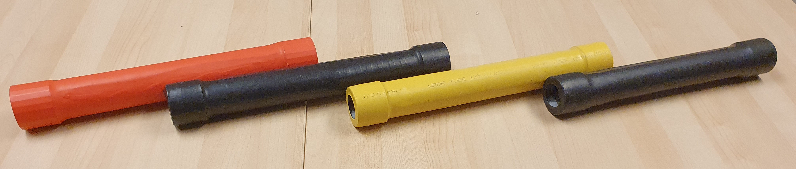

# About us

The T-Stick is a DMI conceived by Joseph Malloch and D. Andrew Stewart at the Input Devices and Music Interaction Laboratory (IDMIL) at McGill University. It has been in development since 2006, has a relatively long history for a DMI, has multiple versions, several expert performers, and has an associated repertoire. More than 20 copies have been built unintended for commercial use. Nevertheless, it has been adopted by expert performers and composers as part of their musical practice including D. Andrew Stewart (Soprano user) and Fernando Rocha (Tenor user). It has appeared in dozens of public appearances in countries such as Canada, USA, Brazil, Italy, Norway, and Portugal.

<iframe src="https://www.youtube.com/embed/BudSGA511pg?si=oSp4g7a-amvRy366" style="position:absolute;top:0;left:0;width:100%;height:100%;" frameborder="0" allow="autoplay; fullscreen; picture-in-picture" allowfullscreen></iframe>

## Read More
- [:simple-github: Source Code](https://github.com/IDMIL/T-Stick)
- [:material-music-note: Project Website](https://www.idmil.org/project/the-t-stick/)