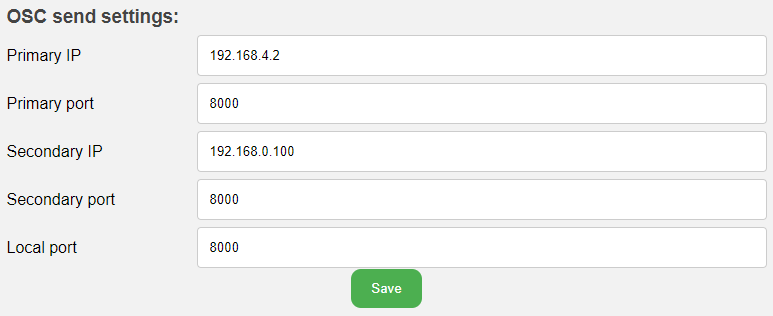

# Changing your WiFi Settings

!!! note

    This page only applies to the T-Stick 4GW/5GW and their variants.

To access the T-Stick Settings page, access the T-Stick Setup page using the instructions shown in the connection guide.

## Disabling OSC

To disable OSC set the __Primary IP__ field and the __Secondary IP__ field `0.0.0.0`.

<figure markdown="span">
  
  <figcaption>OSC Send Settings</figcaption>
</figure>

## Enabling/Disabling Libmapper

Click the __Settings__ option at the top of the page. To disable libmapper set the __enable_libmapper__ setting to `0`.